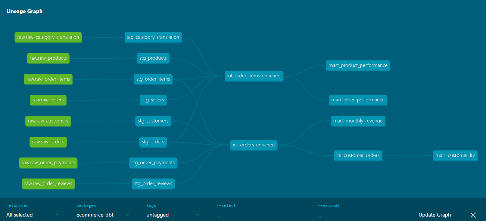
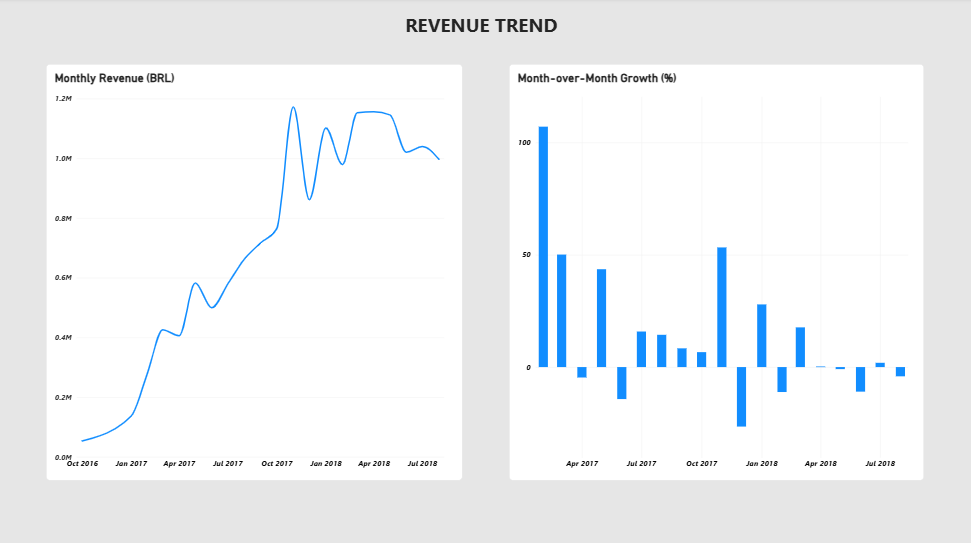
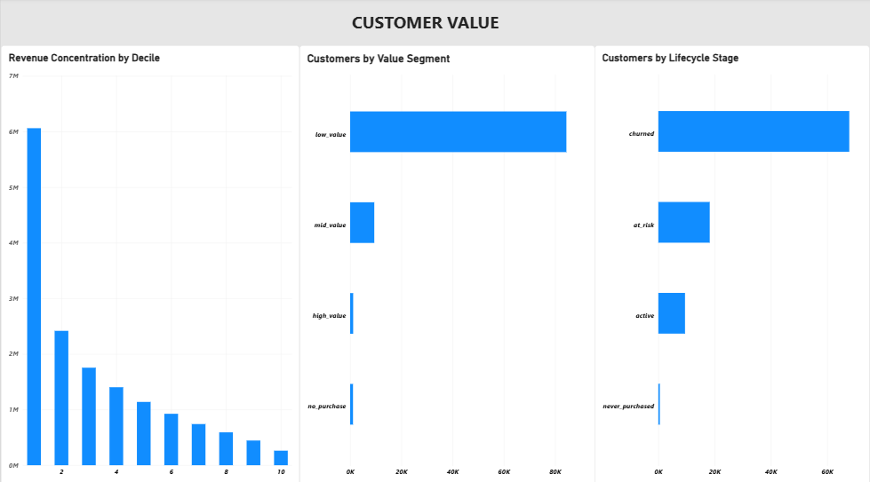
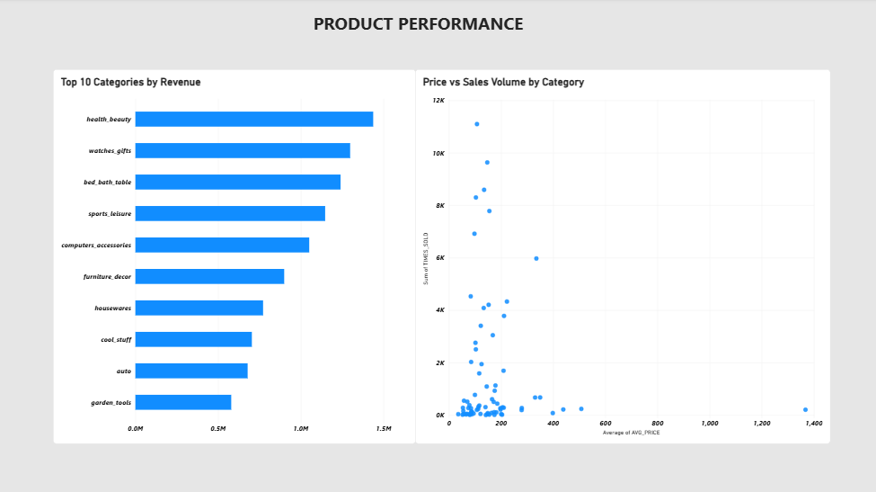
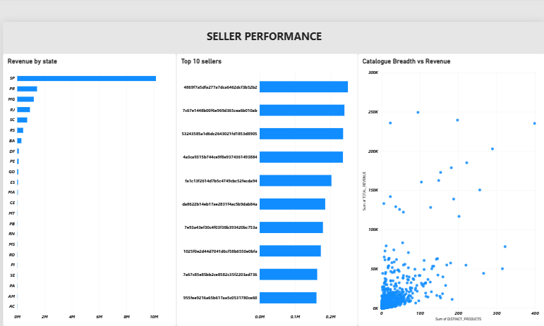
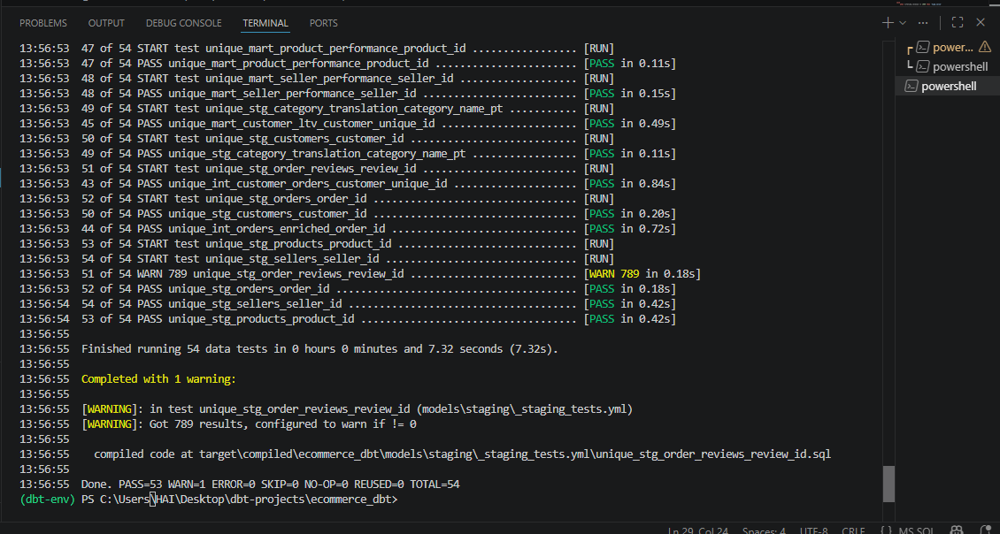
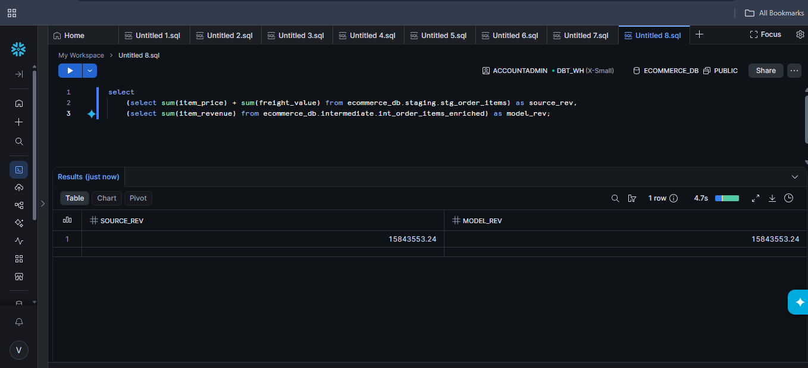
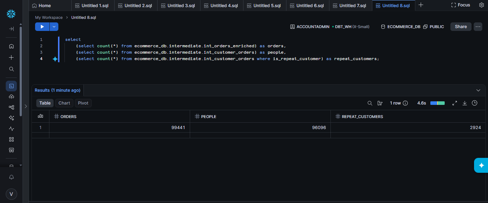

# Brazilian E-Commerce Analytics Pipeline — dbt Core + Snowflake


## Overview

An end-to-end analytics engineering pipeline built with **dbt Core** on **Snowflake**, transforming **550,759 raw rows** of Brazilian e-commerce marketplace data into four business-ready mart tables.

**15 models** across four layers, **54 data tests**, full column-level documentation with an auto-generated lineage graph, and a four-page Power BI report built on the mart layer.

Every layer reconciles to the source **to the cent** — R$15,843,553.24 in, R$15,843,553.24 out.

---

## Lineage



Eight raw sources → eight staging views → three intermediate models → four marts.
Every dependency resolved by dbt from `ref()` calls — nothing hand-ordered.

---

## Architecture

```
Olist CSV Files (Kaggle)                          550,759 rows
        ↓  Snowsight bulk load, explicit DDL
        ↓
ECOMMERCE_DB.RAW                                  8 tables
        RAW_CUSTOMERS            99,441
        RAW_ORDERS               99,441
        RAW_ORDER_ITEMS         112,650
        RAW_ORDER_PAYMENTS      103,886
        RAW_ORDER_REVIEWS        99,224
        RAW_PRODUCTS             32,951
        RAW_SELLERS               3,095
        RAW_CATEGORY_TRANSLATION     71
        ↓  rename + cast only — no business logic
        ↓
ECOMMERCE_DB.STAGING                              8 views
        stg_customers, stg_orders, stg_order_items,
        stg_order_payments, stg_order_reviews,
        stg_products, stg_sellers, stg_category_translation
        ↓  aggregate to grain BEFORE joining
        ↓
ECOMMERCE_DB.INTERMEDIATE                         3 views
        int_orders_enriched          99,441   (one row per order)
        int_customer_orders          96,096   (one row per person)
        int_order_items_enriched    112,650   (one row per line item)
        ↓  group by + window functions
        ↓
ECOMMERCE_DB.MART                                 4 tables
        mart_monthly_revenue             24
        mart_customer_ltv            96,096
        mart_product_performance     32,735
        mart_seller_performance       3,056
```

---

## Dashboard

Four Power BI report pages built directly on the mart layer — no transformations
in Power BI, because the modelling is already done in dbt where it can be tested
and version controlled.






Connected in **Import mode** rather than DirectQuery: the data is static and
historical, so live querying buys nothing, and the `.pbix` keeps working after
the Snowflake trial expires.

---

## Tech Stack

| Tool | Purpose |
|---|---|
| dbt Core 1.12 | Transformation, testing, documentation, lineage |
| dbt-snowflake 1.12 | Snowflake adapter |
| Snowflake | Cloud data warehouse — compute and storage |
| Jinja | Templating for `ref()`, `source()`, custom macros |
| Python venv | Isolated dbt install |
| RSA key-pair auth | Service-account authentication (no passwords) |
| Power BI Desktop | Four-page report on the mart layer (Import mode) |

---

## Dataset

**Source:** [Olist Brazilian E-Commerce Public Dataset](https://www.kaggle.com/datasets/olistbr/brazilian-ecommerce) — 100k real orders from a Brazilian marketplace, Sep 2016 to Sep 2018.

| File | Rows | Contents |
|---|---|---|
| olist_customers_dataset.csv | 99,441 | Customer keys, city, state, zip |
| olist_orders_dataset.csv | 99,441 | Order status and five lifecycle timestamps |
| olist_order_items_dataset.csv | 112,650 | Line items, price, freight, seller |
| olist_order_payments_dataset.csv | 103,886 | Payment type, installments, value |
| olist_order_reviews_dataset.csv | 99,224 | Review score and comments |
| olist_products_dataset.csv | 32,951 | Category, weight, dimensions, photos |
| olist_sellers_dataset.csv | 3,095 | Seller location |
| product_category_name_translation.csv | 71 | Portuguese → English category names |

The geolocation file (1M rows) was deliberately excluded — no model in this project consumes it.

---

## Project Structure

```
ecommerce_dbt/
├── models/
│   ├── staging/
│   │   ├── _sources.yml                    # 8 source table declarations
│   │   ├── _staging_tests.yml              # tests + descriptions
│   │   ├── stg_customers.sql
│   │   ├── stg_orders.sql
│   │   ├── stg_order_items.sql
│   │   ├── stg_order_payments.sql
│   │   ├── stg_order_reviews.sql
│   │   ├── stg_products.sql
│   │   ├── stg_sellers.sql
│   │   └── stg_category_translation.sql
│   ├── intermediate/
│   │   ├── _intermediate_tests.yml
│   │   ├── int_orders_enriched.sql
│   │   ├── int_customer_orders.sql
│   │   └── int_order_items_enriched.sql
│   └── mart/
│       ├── _mart_tests.yml
│       ├── mart_monthly_revenue.sql
│       ├── mart_customer_ltv.sql
│       ├── mart_product_performance.sql
│       └── mart_seller_performance.sql
├── macros/
│   └── generate_schema_name.sql            # schema override
├── screenshots/
│   ├── lineage_graph.png
│   ├── dashboard_revenue.png
│   ├── dashboard_customers.png
│   ├── dashboard_products.png
│   ├── dashboard_sellers.png
│   ├── dbt_test_results.png
│   ├── revenue_reconciliation.png
│   └── grain_validation.png
├── snapshots/
├── seeds/
├── ecommerce_dashboard.pbix                # Power BI report
├── dbt_project.yml
├── .gitignore
└── README.md
```

---

## Key Engineering Decisions

### 1. The fan-out trap — aggregate to grain before joining

Four tables relate to an order at four different grains: orders (99,441), line items (112,650), payments (103,886), reviews (99,224).

Joining them directly multiplies rows. An order with 3 line items and 2 payment records becomes **6 rows** — every item price counted twice, every payment counted three times. SQL raises no error. Revenue is silently inflated by an arbitrary factor that varies per order.

The fix is one rule: **never join two tables at different grains without collapsing one first.**

```sql
item_totals as (
    select order_id, count(*) as item_count, sum(item_price) as items_revenue
    from {{ ref('stg_order_items') }}
    group by 1                      -- 112,650 rows → 98,666, one per order
),
payment_totals as (
    select order_id, sum(payment_value) as total_paid
    from {{ ref('stg_order_payments') }}
    group by 1                      -- 103,886 rows → 99,440
)
-- only now is it safe to join
```

Verified two ways: the model returns exactly 99,441 rows, and total revenue matches the source to the cent.

### 2. `customer_id` is not a customer

This dataset generates a **new `customer_id` for every order placed**. It is an order-scoped key wearing a customer-shaped name. The person is `customer_unique_id`.

Grouping by the wrong column produces 99,441 "customers", each with exactly one order, and a repeat purchase rate of **0%**.

Grouping by the right one: **96,096 people, 2,924 repeat buyers, a 3% repeat rate.**

Both queries succeed. Both return clean output. Only one is true.

### 3. `try_to_` casts paired with `not_null` tests

Raw tables were created with explicit DDL, all columns VARCHAR, to avoid Snowflake's schema inference producing quoted lowercase identifiers from the CSV headers.

Staging casts with `try_to_timestamp()`, `try_to_double()` and `try_to_number()`, which return NULL on failure rather than aborting the run. On its own that would hide bad data — so every cast column carries a `not_null` test. The pipeline still fails on bad input, but it surfaces the offending rows instead of a stack trace.

Zip codes are deliberately left as VARCHAR: `01151` cast to a number becomes `1151`.

### 4. Left joins everywhere in the intermediate layer

768 orders have no review. 610 products have a NULL category. An inner join would silently delete those rows and shrink reported revenue.

Every join is `left`, with `coalesce(x, 0)` applied only where zero is the honest answer:

```sql
coalesce(i.item_count, 0)  as item_count,    -- no items really is zero
p.total_paid,                                -- no payment ≠ paid zero
r.avg_review_score                           -- no review ≠ scored zero
```

Coalescing a missing review to 0 would drag every downstream average downward and be a lie.

### 5. Recency measured against the dataset, not the clock

The obvious way to compute days-since-last-order is `datediff('day', last_order_at, current_date())`. It is wrong here.

This dataset ends in October 2018, so every customer would show ~2,800 days of inactivity — and the number would change every time the model ran. Same query, different answer tomorrow. That is a clock, not a metric.

Instead the model anchors to the dataset's own end date:

```sql
dataset_end as (
    select max(purchased_at) as last_date_in_data from orders
)
...
datediff('day', f.last_order_at, d.last_date_in_data) as days_since_last_order
```

### 6. Custom schema naming macro

By default dbt concatenates the target schema with the custom one, producing `STAGING_INTERMEDIATE`. The macro below makes custom schema names literal:

```sql

    
        {{ target.schema }}
    
        {{ custom_schema_name | trim }}
    

```

### 7. Views for staging and intermediate, tables for mart

Staging and intermediate are views — zero storage, always current, and they exist to be composed rather than queried directly. Marts are materialised as tables so a BI tool reading them does not recompute the full join graph on every dashboard refresh.

---

### 8. Import mode, not DirectQuery

Power BI connects to the mart schema in Import mode. DirectQuery would keep the report live against Snowflake, but this data is static and historical — freshness buys nothing, and every filter click would fire a warehouse query.

Import also means the `.pbix` keeps working after the Snowflake trial expires, so the report stays reproducible for anyone opening this repo.

### 9. No transformations in Power BI

The Navigator loaded four mart tables and nothing else — no staging, no intermediate, no Power Query steps.

Business logic in a `.pbix` cannot be version controlled, tested, or reviewed. It also drifts: let three dashboards each define revenue and within a year there are three different revenue numbers. Keeping the modelling in dbt means one definition, tested on every run.

Power BI's auto-detected relationships between the four marts were also removed. The marts sit at four different grains — person, month, product, seller — and a relationship between them would let a filter on one silently produce wrong aggregates in another. Same failure mode as the fan-out, different tool.

---

## Mart Layer

### mart_monthly_revenue
Marketplace performance by month, with month-over-month growth via `lag()`.
```sql
SELECT order_month, total_orders, unique_customers, total_revenue, revenue_growth_pct
FROM mart_monthly_revenue
ORDER BY order_month
```

### mart_customer_ltv
Lifetime value per person with value segmentation, lifecycle stage and revenue decile.
```sql
SELECT customer_unique_id, lifetime_revenue, total_orders,
       value_segment, lifecycle_stage, revenue_decile
FROM mart_customer_ltv
WHERE value_segment = 'high_value'
ORDER BY lifetime_revenue DESC
```

### mart_product_performance
Revenue and volume per product, ranked globally and within category.
```sql
SELECT product_id, product_category, times_sold, total_revenue,
       revenue_rank, rank_in_category
FROM mart_product_performance
ORDER BY revenue_rank
```

### mart_seller_performance
Seller revenue, catalogue breadth and active lifespan.
```sql
SELECT seller_id, seller_state, total_orders, distinct_products,
       total_revenue, revenue_per_order, revenue_rank
FROM mart_seller_performance
ORDER BY revenue_rank
```

---

## Testing

**54 tests, PASS=53 WARN=1 ERROR=0.**




| Test type | Checks |
|---|---|
| `unique` | Grain integrity on every primary key across all four layers |
| `not_null` | Every key, every cast column, every revenue field |
| `relationships` | Referential integrity: orders → customers, order_items → orders |
| `accepted_values` | Order status, review scores 1–5, segment and lifecycle labels |

### The test that fails on purpose

`review_id` looks like a primary key. It is not.

```
WARN 789  unique_stg_order_reviews_review_id ......... [WARN 789 in 0.18s]
```

Inspecting the failures showed a clear pattern — every duplicate is the same `review_id` against **two different `order_id`s, with an identical score and timestamp**:

```
00130cbe1f9d422698c812ed8ded1919 | 04a28263e085d399c97ae49e0b477efa | 1 | 2018-03-07
00130cbe1f9d422698c812ed8ded1919 | dfcdfc43867d1c1381bfaf62d6b9c195 | 1 | 2018-03-07
```

This is not corrupt data. It is a customer with **two open orders** who received the review survey and answered once — Olist recorded the single response against both orders.

So the grain of that table is *review-to-order link*, not *review*. `count(distinct review_id)` undercounts survey responses by 789; `count(*)` overcounts them.

The test is kept permanently at `severity: warn`. It surfaces on every run and is documented in the model description, so the quirk is impossible to rediscover the hard way.

---

## Validation Results

| Check | Expected | Result |
|---|---|---|
| Raw rows loaded | 550,759 | ✅ 550,759 |
| `int_orders_enriched` grain | 99,441, no duplicates | ✅ 0 duplicate order_ids |
| `int_customer_orders` grain | one row per person | ✅ 96,096 |
| `int_order_items_enriched` grain | 112,650, no duplicates | ✅ 0 duplicates |
| Revenue reconciliation — source | R$15,843,553.24 | ✅ exact match |
| Revenue reconciliation — customer layer | R$15,737,667.52 | ✅ exact match (cancelled excluded) |
| dbt tests | all green | ✅ PASS=53 WARN=1 ERROR=0 |
| Full build | 15 models | ✅ 18.0s |

**Revenue reconciliation** — source total against the model total, run side by side
in one query. Both return R$15,843,553.24. No rounding, no drift, no fan-out.



**Grain validation** — 99,441 orders, 96,096 people, 2,924 repeat buyers. The gap
between the first two numbers is decision 2 in action: `customer_id` counts orders,
`customer_unique_id` counts people.



---

## Findings

**The marketplace grew roughly 10x in 18 months** — R$137k in January 2017 to R$1.15M by March 2018, then plateaued around R$1M per month.

**November 2017 spikes to 7,507 orders, +53%.** Black Friday. December drops 26% immediately after — the pull-forward effect landing exactly where expected.

**216 products have never sold on a completed order. 39 sellers have never made a single sale.** Both fall out automatically once cancelled orders are filtered.

**A 3% repeat purchase rate** across 96,096 customers — visible only when grouping on the correct customer key.

**The top 10% of customers drive close to 40% of revenue.** Decile 1 alone
accounts for roughly R$6M of R$15.7M.

**Catalogue breadth does not drive seller revenue.** Sellers carrying under 50
distinct products regularly match or beat those carrying 300+. Focus outperforms
range in this marketplace.

**The growth column has a real defect.** January 2017 reports +697,878.9% growth. The arithmetic is correct: December 2016 did R$19.62 across a single order. Those boundary months are extraction artifacts, not business activity, and any chart built on that column is unreadable. Documented rather than quietly dropped.

---

## How to Run

### Prerequisites
- Snowflake account (trial is sufficient)
- Python 3.9+
- The eight Olist CSV files from Kaggle
- Power BI Desktop (optional — only to open the report)

### Steps

**1. Provision Snowflake**
```sql
CREATE WAREHOUSE DBT_WH WITH WAREHOUSE_SIZE = 'XSMALL' AUTO_SUSPEND = 60;
CREATE DATABASE ECOMMERCE_DB;
CREATE SCHEMA ECOMMERCE_DB.RAW;
CREATE SCHEMA ECOMMERCE_DB.STAGING;
CREATE SCHEMA ECOMMERCE_DB.INTERMEDIATE;
CREATE SCHEMA ECOMMERCE_DB.MART;
CREATE ROLE DBT_ROLE;
```

**2. Create the raw tables with explicit DDL** (all VARCHAR — see decision 3) and load the CSVs via Snowsight → Load Data.

**3. Install dbt**
```bash
python -m venv dbt-env
source dbt-env/bin/activate        # Windows: .\dbt-env\Scripts\Activate.ps1
pip install dbt-core dbt-snowflake
```

**4. Configure `~/.dbt/profiles.yml`**
```yaml
ecommerce_dbt:
  target: dev
  outputs:
    dev:
      type: snowflake
      account: <your_account_identifier>
      user: DBT_USER
      private_key_path: <path_to_your_key.p8>
      role: DBT_ROLE
      database: ECOMMERCE_DB
      warehouse: DBT_WH
      schema: STAGING
      threads: 4
```

**5. Build and verify**
```bash
dbt debug          # confirm the connection
dbt run            # build all 15 models
dbt test           # run all 54 tests
dbt docs generate  # build the catalog
dbt docs serve     # browse docs + lineage graph
```

**6. Open the dashboard (optional)**

Open `ecommerce_dashboard.pbix` in Power BI Desktop. It opens with data already
loaded — no Snowflake connection required. To point it at your own warehouse:
Home → Transform data → Data source settings → change the server to your account
identifier, then Refresh.

---

## Author

**Venkatesh Lankalapalli**
[LinkedIn](https://www.linkedin.com/in/venkateshlankalapalli) | [GitHub](https://github.com/venkateshlankalapalli45)

---

*Built as a five-day analytics engineering series — learning dbt from scratch while building a production-shaped pipeline, and documenting every trap found along the way.*
